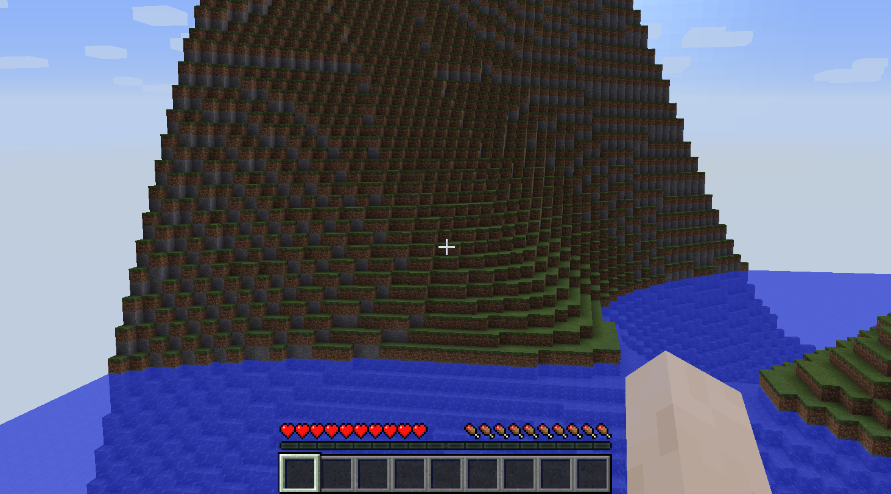

# 

This repository contains the essential bricks of the [Tuubes project](http://tuubes.org), which aims to create an open-source scalable server for voxel games.

TuubesCore is independent from any game. Game-dependent content like block types and creatures are/will be implemented in others repositories.

## How to contribute
Contributors are always welcome. But please note that the [foundations](https://github.com/tuubes/TuubesCore/projects/4) aren't complete yet, therefore a lot of things are currently changing.

To contribute to the code, fork the repository, modify what you want, and send a [pull request](https://help.github.com/articles/about-pull-requests/). New ideas and issues can be reported as [github issues](https://github.com/mcphoton/Photon-Server/issues).

For more information please read [the contributing guidelines](CONTRIBUTING.md).

## Project structure
### Branches
- **master**: stable releases only
- **develop**: base branch for unstable development
- **scala-rewrite**: contains the ongoing work to rewrite the project in [the Scala programming language](http://docs.scala-lang.org), and by following the [Actor Model](https://en.wikipedia.org/wiki/Actor_model).

### Modules
- **core**: most of the source code
- **metaprog**: scala macros used by the core

## Current state
* Next milestone: [Awesome Architecture](https://github.com/tuubes/TuubesCore/milestone/3)
* Ongoing github project: [Foundations](https://github.com/tuubes/TuubesCore/projects/4)
* Screenshot of the last release (0.5-alpha):

